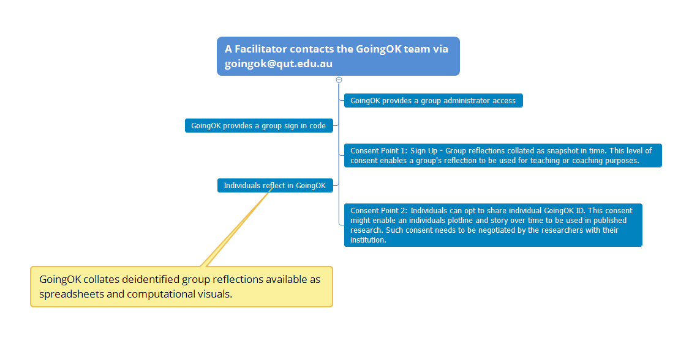

## Facilitator's guide

GoingOK is a great way for learners to keep track of their thoughts and feelings as they transition to new experiences. Thank you for considering using it as part of your teaching or research project.

GoingOK can also help leaders who are working with groups of people get an insight into how to better support the learning of their group members. People who have used the tool tell us that it feels like a big listening ear, it helps them process their experiences, and it keeps their reflective ideas all in one place so it is easy to see patterns over time.

This information in this guide is designed to give you an idea of what is involved as you prepare users to sign up. There is also a [Goingok User's Guide]() that you can give to your prospective participants. 

> It feels like a big listening ear! It helps process my experiences and it keeps my reflective ideas all in one place so it is easy to see patterns over time

@@include(components/what_is_goingok.md)

### Benefits of GoingOK

- **Convenient:** The online app is easy to use on a range of devices.
- **Scalable:** GoingOK is designed to be effective for small groups and large groups with thousands of users.
- **Computational analysis:**  Enables you to see patterns that you would not see otherwise.
- **Supports dialogic engagement:** A group facilitator can establish responsive feedback loops by feeding back the big ideas of the group reflections to the group.

@@include(components/how_does_it_work.md)

### Who can use GoingOK?

GoingOK can be used in any field! Whether you need feedback from first year teachers, students or nursing students. Some examples of fields that can benefit from GoingOK:

- First year teachers
- Nursing Students
- Students on prac
- Tertiary students re-entering study
- Mature age students

### How do you use GoingOK? 

This is what a user sees when they are logged into their GoingOk profile.

The text is then recorded in the plotline and the digital participant story.

### Facilitator usage

Behind the scenes, a facilitator can have access to a spreadsheet of deidentified results for the group.

The sliding scale that the users used converts their response to a numbered scale of 0 - 100.

The deidentified entries for the group can be downloaded and analysed for patterns. As a facilitator you can also apply to access computational data representations of the cohort such as heat maps of points over time or sentiment analysis highlighting linguistic patterns.

These levels of analytic access would be negotiated with the GoingOk facilitators if you decide to go ahead with using the tool.

Below is an image of a heatmap generated by the above tool.

### The benefits of group feedback patterns

GoingOk is designed to benefit individuals as they reflect, but also to enable a facilitator to see patterns that are common within a group, and over time.

Previous users have found it beneficial as it is:

- **Convenient** – The online app is easy to use on a range of devices. Users can log in at any time, and anywhere. This enables data to be collected from users who are located in geographically dispersed locations.
- **Scalable** – GoingOk is designed to be effective for small groups and large groups with 1000s of users.
- **Collects rich qualitative and quantitative data over time.**
- **Computational analysis** enables you to see patterns that you would not see otherwise.
- **Supports dialogic engagement** – A group facilitator can establish responsive feedback loops by feeding back the big ideas of the group reflections to the group.

### Design deliberate pedagogic support 

We have found that groups engage with using GoingOk where these conditions are met in the pedagogic design.

- **Purposeful** – Individual reflection is more likely if it is purposefully designed into the learning or research so that the act of reflecting in a journal is intrinsically motivating and helpful to the author. Examples of purposes that others have used GoingOk for include:
    - *Recording personal feelings during a new experience* – Early career teachers who face a number of challenges adapting to their new situations may not yet feel confident to raise all of their successes or problems in a new workplace. GoingOk is a neutral and supportive space to record frustrations or excitement, and to work out what to do next.
    - *Reflecting on new ideas* – When learners come across new ideas in a learning situation whether that is from an academic reading or discussion, it can help to record what seems striking or unclear, and how these ideas might relate to previous thoughts or ongoing questions.
    - *Professional records* – Many professions require evidence of reflection. It can be challenging to recall specific instances in a busy professional life. The ongoing record of GoingOk can help a professional remember key events, or see patterns, and be a source of evidence for other professional portfolios. Preservice teachers and science students have used GoingOK for assessment records.
    - *Small group accountability* – Group members were required to reflect each week, and then in their group meeting share a key idea. In their group report, they needed to indicate how they adjusted their thinking based on their analysis of their GoingOk reflections.
    - *Formative assessment for self regulation and metacognition* – Tracing learning development over time, where an author can look back and see what ideas have changed, enables learners to engage in self assessment and metacognition. The plotline can help learners regulate their own learning as they evaluate their goals and how closely the reported reflections match their desired learning outcomes.
    - *Assessment evidence* – Reflections that are time stamped and completed over a period of time can be a form of evidence of the author’s human engagement. It can be used to provide evidence of academic integrity and verified author identity through their consistent engagement with developing ideas. Mandating the use of GoingOk as part of an assessment task has been a popular and effective engagement strategy. In these cases the reflections themselves have not been graded, but rather have been incorporated into the task e.g.: select one of the reflections and analyse it in more detail, or identify some common patterns across your reflections and relate these to literature.
  
- **Broad prompts** – Reflections have been richer where users have been given broad rather than narrow prompts for reflection. In some projects, there have been no further prompts other than those in the tool interface – ‘How are you going?”. In some projects regular prompts in lectures or group emails have included:
    - What new ideas have been raised for you?
    - How do the ideas from this reading resonate with your experiences?
    - What has happened this week in your practical experience?

- **Responsive** – User engagement has been successful when lecturers or researchers respond in some way to the group, to show that the reflections from the group have been read, and have inspired some responses. Examples of where this has occurred in previous situations include:
    - **Dialogic feedback loops** – The teacher would read the reflections at the end of each week, and then give a summary at the start of the next week of some of the shared ideas. She would then also indicate what she was adjusting in her planning to respond to the student feedback.
    - **Researcher led focus groups** – After a few weeks, the researchers brought the individuals together in a focus group to do some group analysis of some selected reflections. The users added valuable insights to the data analysis, but also felt affirmed that their data was being valued.
    - **Collaborative design of research** – Participants were included as part of the research design, and understood why the GoingOk tool was selected, and how the data would be analysed and used for reporting.
    
- **Relationships** – Individuals are more likely to use GoingOk regularly if they have a positive interpersonal connection with the group facilitator. Where the group facilitator can be enthusiastic in promoting use of the tool, can explain why it is important to use, and give reminders to users to reflect there is much greater response rates. Additionally, there is greater use when facilitators are available to provide timely assistance where students may have questions.
        
- **Reminders** - Users are more motivated to continue using the tool as they see their plotlines grow and their stories develop over time with multiple entries. As life gets busy, it is easy to forget to log in. Email reminders to the group, scheduled activities and time in meetings or classes to reflect have been effective reminder strategies.

- **Trust** - Using a new technology can be daunting. There has been greater use of GoingOk where students are given information about GoingOk. Examples of how this has happened in the past:
    - A demonstration by their facilitator.
    - A video tour of how to log on (link to GoingOk youtube site)
    - A testimonial from a previous user of GoingOK about the benefits of using GoingOk.
              
### Teachers or coaches using GoingOK need support</h2>

Teachers who are planning to use the tool with their learners to encourage their reflections also need support. Some of the common questions or concerns they have raised that a facilitator would need to consider and address include:
          
- **What happens if someone is distressed?** As users are de-identified by the GoingOk tool, it is not possible to identify individuals who may indicate that they are distressed by recording a low score on the slider or by writing reflections that indicate they are struggling. It is important that teachers manage expectations for responsiveness at the time of sign up and point to other sources of support such as help lines or counselors within the institution and also available to members of the public. Where a student identifies that they are distressed, teachers can respond to the group to indicate general advice, or to point to the help options. On the GoingOk user documentation, users are advised to: **Reach out if you need extra help to Go Ok**

> GoingOk can not respond to any entries that indicate distress. GoingOk is not monitored, and as your entries are deidentified, there is no way to identify who or where you are. If you are concerned about how you are going, reach out to one of the many organisations in your local area who can provide immediate support.

- **What if students criticise me?** In situations where customer and student satisfaction is used to evaluate performance, it is understandable that teachers can feel vulnerable about seeking feedback. The design of the question where individuals are encouraged to reflect on their own learning has meant that there have been very few instances where students criticize teachers. One approach in supporting teachers who may be concerned has been appointing a neutral party to first screen the group report for any material that is likely to cause distress.

- **Do I need to read all reflections?** As users can write as much as they like in the text box, reflections can be detailed. In large groups this can involve a lot of reading. It will depend on the reflective purpose whether a teacher feels the need to read all reflection. The spreadsheet report can assist teachers who wish to engage in a selective sampling of responses. The reflections can be downloaded in a spreadsheet that can allow for ‘ordinal sorting’ of reflections that have high, mid and low values on the sliding scale. Interestingly the topics and concerns do not always match the numerical value.
               
- **How do we fit it into a crowded teaching agenda?** Reflection is a valuable learning experience that supports metacognition, self-assessment, and self-regulation of emotions and academic engagement. It is also hard to fit in. Deliberately designing GoingOk into a pedagogic purpose, regular learning event, or assessment task helps to make sure it has some space in a crowded agenda.

### Thinking through ethical issues

GoingOk is committed to supporting good outcomes for users.

GoingOk can be used just for teaching purposes, or for research purposes as well. Where there are unequal power relationships, such as those between teachers and students, or researchers and participants, it is important to think through how to minimize any risk of harm. GoingOk group facilitators need to seek ethical consent from their institutions before using any GoingOk data for research or publication purposes.

**A foundational principle of GoingOk is that the person who is reflecting is the author and owner of their reflections.**

Users are reassured about the privacy of their data on the GoingOK webpage and user guidelines.

### User journey map

### Cost considerations when using GoingOK

GoingOk has been designed to be accessible and useful. There are a couple of ways you can be involved in using GoingOk.
- The source code for GoingOk is open access. You can access it from anywhere and set up your own version that can be hosted on your own server. We would ask that you acknowledge Dr Andrew Gibson as the original designer.
- You can use GoingOk in its current form from GoingOk.org. Your data will be hosted on Queensland University of Technology servers, and this may incur a small fee. The fee covers administration and hosting costs, computational reports you may require, and initial coaching and set up advice. This can be negotiated with the team.
- You may like to collaborate in adapting GoingOK with the GoingOk creative team. We love collaborating, but it will depend on the availability of the team and how the proposed project aligns with the ongoing development of GoingOk.

### Thanks for considering using GoingOK

GoingOk has been developed with the generous insights from many people. We hope you find benefits in using GoingOk. You can send us your inquiries of questions by emailing: <a href="mailto:info@goingok.org">info@goingok.org</a>
