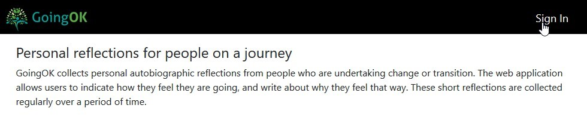
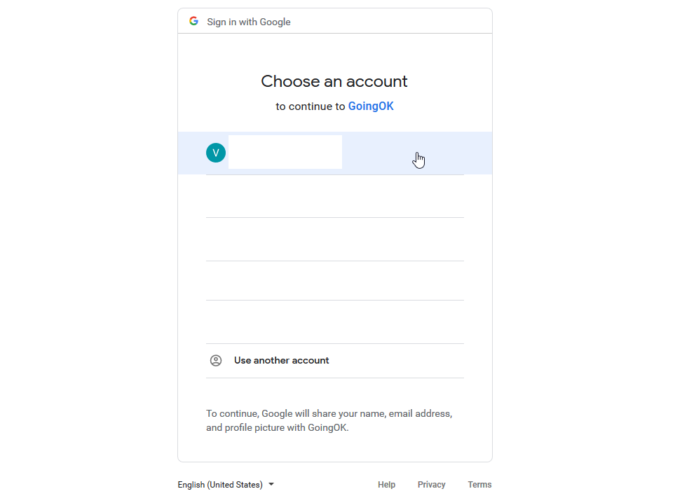
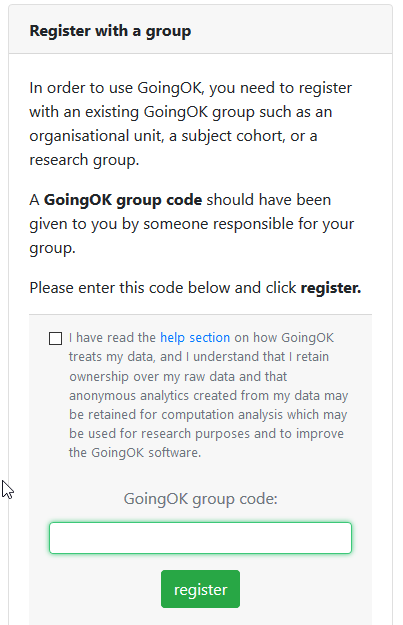
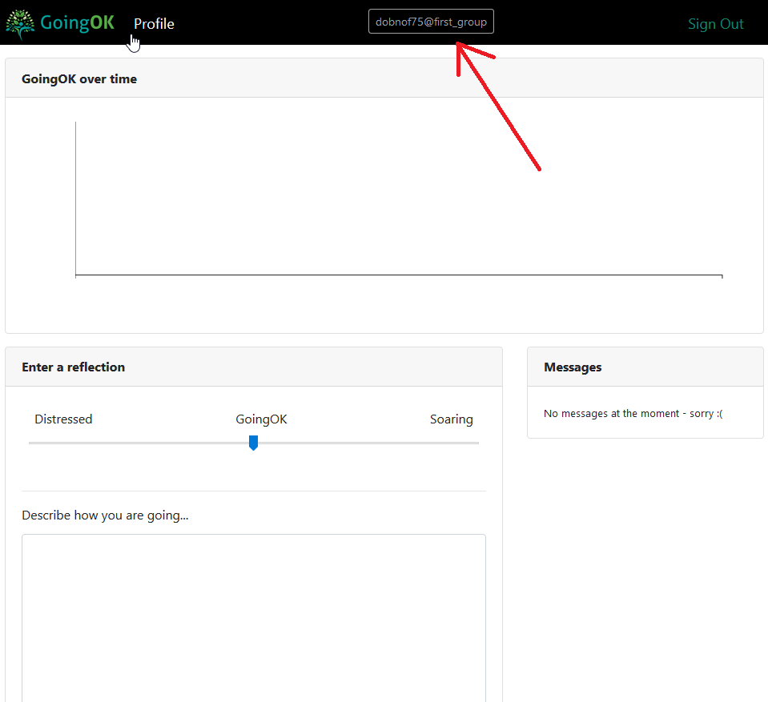
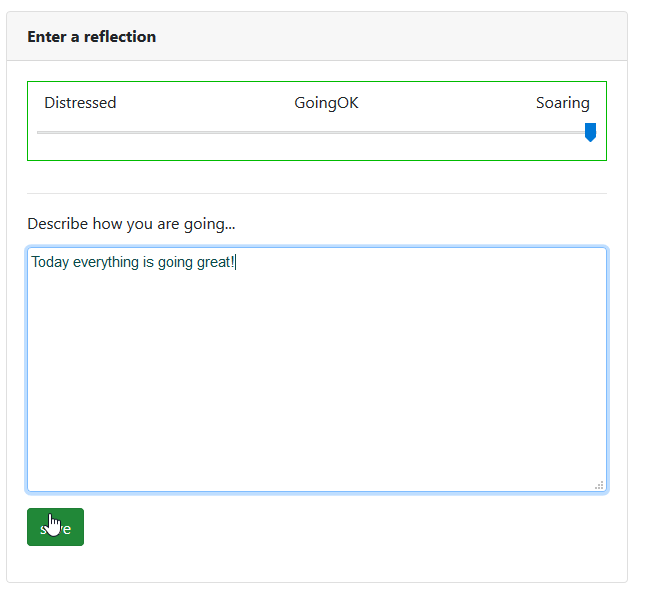
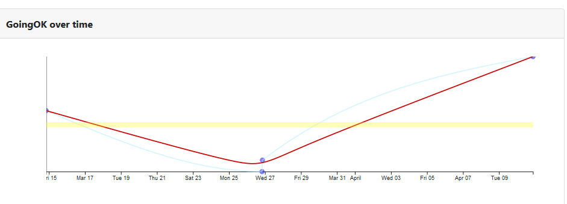

## User's guide

GoingOK is a great way to keep track of your thoughts and feelings as you transition to new experiences. People who have used the tool tell us that it feels like a big listening ear, and helps them process their experiences, and keeps them all in one place so it is easy to see patterns over time.

You may have been invited to use GoingOk to create some online self-reflections as part of a learning task or a research project. The information in this guide is designed to give you an idea of what is involved before you sign up, and how to get started if you decide to go ahead.

@@include(components/what_is_goingok.md)

@@include(components/how_does_it_work.md)

### Why use GoingOK?

GoingOk was designed to facilitate personal reflective writing as reflective writing is a powerful way to learn. It also has proen benefits for wellbeing.  GoingOk was also designed as a way to connect people within a group to a learning feedback loop. When a whole group of people use GoingOK, patterns within the de-identified reflections of the group can be provided to a nominated facilitator who is working with the group of people to get an insight into how to better support the group.

### Privacy

Reflective writing is personal, so GoingOK takes the privacy of your data very seriously. As a GoingOK user, you are anonymous. This is by design, as you are the author and owner of your reflections. The only identifiers that will appear in your data are the ones you choose to write.

Here are the steps we have taken to help you maintain your privacy:
 
- By default GoingOK does not store any personal information with your reflective writing.
- You log in by using a Google account so you don’t have to use your institutional email.
- The GoingOk site does not collect any of your Google information.
- Reflections are stored in a secure server hosted by Queensland University of Technology.
- When you first login, you are assigned a unique ID which allows us to ensure that your writing remains yours alone and is there the next time that you login. This is the code at the top of your login page.
- You may cancel your account at any time and your data will be deleted from the system when you do.
- While you keep a GoingOK account, the GoingOK design team may analyse your data for the purposes of providing a range of services including insights on your reflective writing and on the writing of groups of people. However, any analyses are kept separate from your data and cannot be linked back to you. Put simply, you cannot be identified through any of the analyses that GoingOK performs on your data. Some of these analyses may form the basis of computer models, and these models will be owned by GoingOK and may exist independently of your data, and therefore may remain after your account has been deleted.

GoingOk has also been designed for individuals to use when they are part of a group of people who will benefit from a reflective tool. When a group’s anonymous reflections are collected together a group leader may be given access to see the group’s deidentified reflections. They will be able to look for patterns in the reflections.

These patterns can inform a teacher or researcher about what some common experiences and feelings have been. They might be able to design some changes to the learning or make some recommendations in response. They will not be able to publish from any of the reflections without your additional consent (see consent step 2).

**You give your consent to share your individual reflections in 2 different ways:**

- When you put in a group code as you sign up for GoingOK. The group code allows a group administrator to see the whole group’s anonymous reflections at a moment in time. Examples of how this has benefited groups in the past include:
- A group of early career teachers were able to find out from their group administrator that they were not alone in having difficulties with behaviour management, or feeling overwhelmed as this was a pattern shared by the group. They were able to talk about strategies for success together.
- A teacher used reflections from her class of students to design an adaptation to the lecture the following week when a number of reflections identified a topic that they did not understand.
- When a researcher contacts you and asks if you will share your GoingOk identity so your plotline and collection of reflections can be retrieved. This would look like the plotline and reflections in figure 1 and allow a pattern of reflections to be read over time.  The researcher would contact you to ask if you are willing to help these research projects by allowing limited access to your de-identified data. You would consent by sharing the GoingOk identifier at the top of your profile page.

Examples of how this has benefited research in the past include stories being shared with a community to bring about change:

- Willis, J.E., Crosswell, L.J., Morrison, C., Gibson, A., & Ryan, M. (2017). Looking for leadership: the potential of dialogic reflexivity with rural early-career teachers. Teachers and Teaching: Theory and Practice, 23(7), 794-809. doi:10.1080/13540602.2017.1287695 https://eprints.qut.edu.au/103589/
- Willis, Jill & Crosswell, Leanne (2015) Beginning well - Beginning teacher experiences in Lutheran schools (pilot study). Queensland University of Technology, Brisbane, Qld.

If you accept to allowing your de-identified data to be used for research, researchers may be able to read your writing, but they would not know who you are. They would not have access to information that identifies you. You are not under any obligation to participate in any research, but doing so is unlikely to cause you any harm, and participating helps gain a better understanding of people in your situation.

### Get Started

A short video on getting started with GoingOK is available on the [GoingOK YouTube Channel](https://www.youtube.com/channel/UCIZpMV2QDZGgyLp7cF7Am4w)

#### Go to the website

[https://goingok.org](http://goingok.org)

#### Sign in

Sign in by using the "sign in button" on the taskbar

#### Use your Google account to sign in

GoingOK allows you to use Google to sign in effortlessly. Click a Google account that you own to sign in using Google.

#### Join a group

Once signed in you will be prompted to enter in a group code.

This group code will have been shared with you by the person responsible for the group.

You can decide at this stage whether to proceed. You will see that there is a check box to indicate that you understand how GoingOk treats your data.

#### View your profile

Once signed in and the group code has been entered you will be on the profile page where you can start using GoingOk!

You will notice your de-identified GoingOK code at the top of the page.

#### Use GoingOK

On your profile page you can log your experiences daily. At the bottom you will see a text input box where you can write a description of how things are going.

#### See your profile grow!

Once you have written your description and chosen your mood on the slider, You will be able to click save to log your reflections. The results will be logged over time nd displayed in a graph at the top of your profile page.

#### If you want to delete your account.

Contact [mailto:admin@goingok.org](mail@goingok.org) and request for your account to be deleted. You will need to advise whether you want all of your data to be deleted, or just your personal account data. You will also need to provide the email address that you use to sign in with Google.

### The benefits of reflection

Reflective writing can be helpful in working through challenging situations. Writing down your thoughts about recent events helps you organise them and make sense of them. It allows you to take time to process the emotions associated with significant events, but at your own pace and on your own terms. Often significant events are thrust upon you, you do not have the opportunity to choose how you will react. Mostly, in these situations you will react instinctively, intuitively, or in accordance with training or habits developed over time. If you lack experience in dealing with particular challenging situations, your quick decisions may not look as appropriate in hindsight. Reflecting on these situations and the decisions made, will allow you to consider what you might change next time. In other words, reflective writing helps you learn from challenging situations.

However, writing reflectively is not just about learning. Many studies have shown that personal wellbeing benefits flow from writing about difficult situations. The process of writing allows you to process things that may be difficult to speak about, or that you do not want to dwell on. It can give you an opportunity to express emotions but without the risk of making that expression to someone who may not understand you.

### Reach out if you need extra help to go ok

GoingOk can not respond to any entries that indicate distress. GoingOk is not monitored, and as your entries are deidentified, there is no way to identify who or where you are. If you are concerned about how you are going, reach out to one of the many organisations in your local area who can provide immediate support.

### Thanks for considering using GoingOK

GoingOk has been developed with the generous insights from many people. We hope you find benefits in using GoingOk. If you have questions you can contact the GoingOk team by emailing: <a href="mailto:goingok@qut.edu.au">goingok@qut.edu.au</a>
